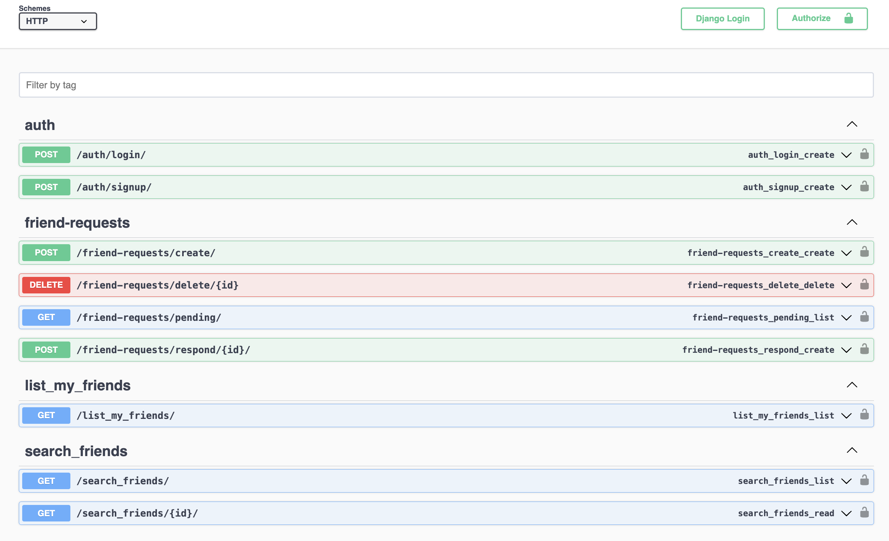

# Social Network Project

This microservice is for Social Network Project

## Features

- Swagger documentation
- Docker support for easy deployment

### Prerequisites

- Python 3.9 or higher
- Django
- Docker (optional)

### Steps for Installation and Run Project

#### Without Docker
1. Clone the repository
```bash
git clone https://github.com/lakshit77/social-network.git .
```
2. Create Virtual Enviornment
3. Install dependency inside Virtual Enviornment from requirements.txt
```bash
pip install -r requirements.txt
```
4. Run Database Migrations
```bash
python manage.py migrate
```
5. Run Project
```bash
python manage.py runserver
```
6. Visit below URL to see the swagger documentation
```bash
Visit http://127.0.0.1:8000/swagger to access the API with Documentation
```

#### With Docker 

1. You can provide any name instead of auth-service
```bash
docker build -t social_network -f Dockerfile.local . 
docker run -p 8000:8000 social_network
```

2. Visit below URL to see the swagger documentation
```bash
Visit http://localhost:8000/swagger to access the API with Documentation
```



